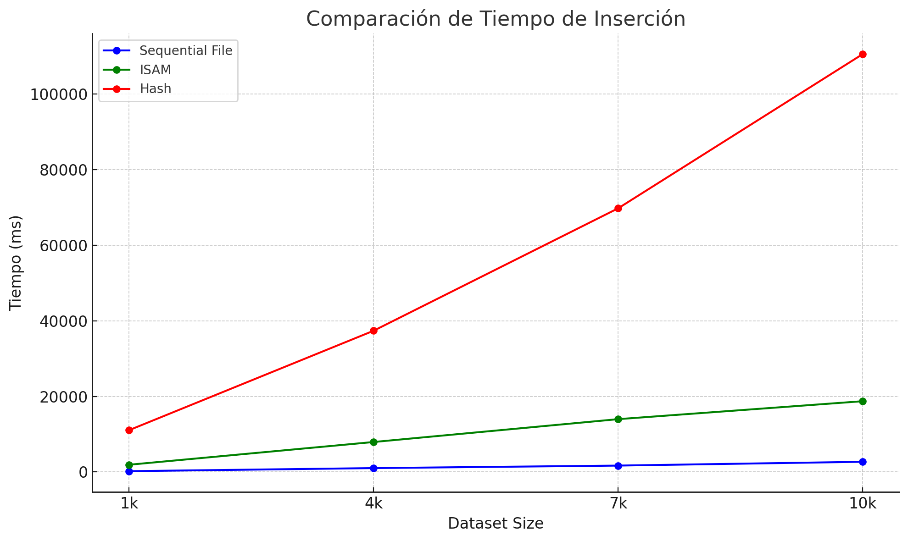
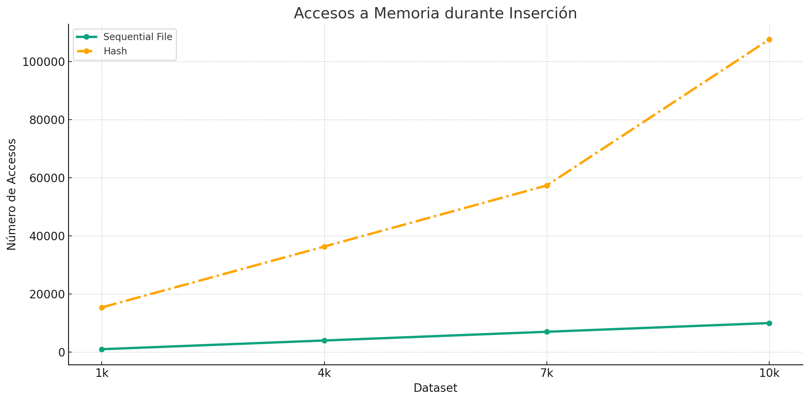
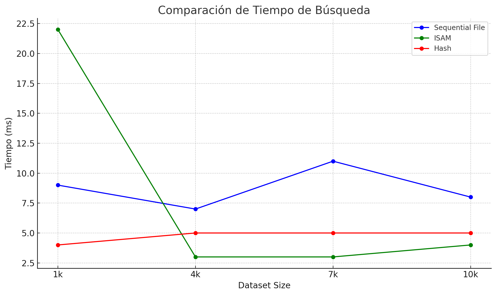
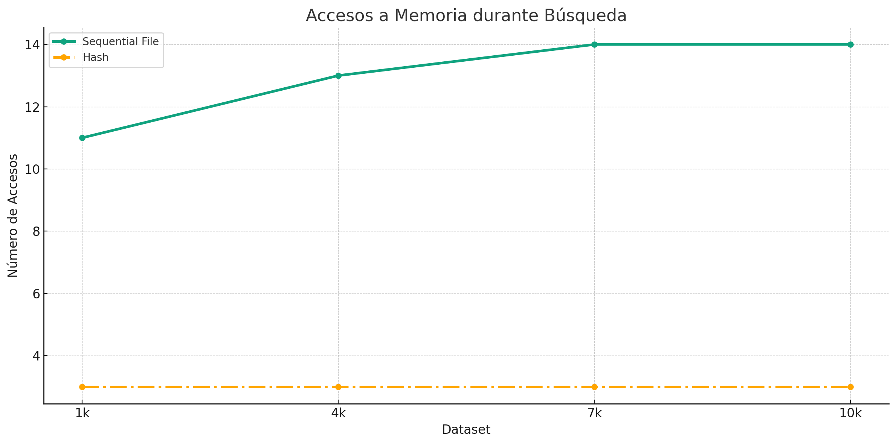

# Proyecto 1 - BDII

## Introducción:

### Objetivo del proyecto
El proyecto busca evaluar y poner en práctica tres técnicas de organización de archivos en memoria secundaria con el objetivo de optimizar el almacenamiento y manejo de los datos. De este modo, los métodos implementados serán el Sequential File, ISAM Sparse-Index y Extendible Hashing. Dentro de cada técnica se abordarán la consulta, la búsqueda secuencial, inserción y eliminicación de registros.

### Descripción del dominio de datos
Este proyecto se apoya en un conjunto de datos llamado "International Football Results from 1872-2023", que se encuentra disponible en [Kaggle](https://www.kaggle.com/datasets/martj42/international-football-results-from-1872-to-2017). El dataset ofrece un registro detallado de partidos de fútbol a través del tiempo, indicando la fecha, equipos involucrados, puntuación, tipo de torneo, ciudad y país donde se llevó a cabo, así como si fue un encuentro en terreno neutral o no.

El conjunto de datos que se presenta abarca un registro comprensivo de 44,341 resultados de partidos internacionales de fútbol masculino, iniciando desde el primer partido oficial en 1872 y extendiéndose hasta el año 2023. Es así, que debido a la necesidad de una estructura más clara y eficiente para el proyecto, el dataset ha sido transformado y se han introducido identificadores únicos y representaciones compactas de los partidos. Estos cambios buscan simplificar el análisis y ofrecer una visión más directa de los eventos.

Los campos dentro del dataset incluyen:

- **MatchID:** ID único del partido. Cada partido registrado en el conjunto de datos cuenta con un identificador que facilita su consulta y análisis.
- **GameSignature:** Representación compacta del encuentro, combinando la fecha del partido con los equipos que participan.
- **MatchDate:** Fecha en la que se llevó a cabo el partido. Está en formato de fecha.
- **EncounterID:** Identificación del enfrentamiento entre dos equipos, sin tener en cuenta la fecha en que se jugó.
- **HomeGoals y AwayGoals:** Puntuaciones del equipo local y visitante respectivamente al final del tiempo reglamentario, incluyendo tiempo extra pero excluyendo penales.
- **HostCountry:** País donde se disputó el encuentro. Esta columna simplifica la información del lugar del partido al centrarse solo en el país anfitrión.
- **TicketsSold:** Cantidad de entradas vendidas para el partido.

El uso de este dataset realista nos será útil para probar nuestras técnicas de organización de archivos.

### Resultados esperados
Al concluir el proyecto, se espera lograr una implementación correcta de las técnicas Sequential File, ISAM Sparse-Index y Extendible Hashing. Mediante estas implementaciones, buscaremos contrastar el rendimiento de las tres técnicas, evaluando aspectos clave como el tiempo requerido para búsquedas, inserciones y eliminaciones.

## 1- Sequential File

Este enfoque gestiona los registros de datos en un archivo principal ordenado, mientras utiliza un archivo auxiliar para administrar inserciones. Cuando el archivo auxiliar alcanza su capacidad máxima, los dos archivos se fusionan y el auxiliar se vacía, quedando listo para más inserciones. Los registros están organizados por una llave específica, y cada registro mantiene punteros hacia el siguiente registro relevante.

### Load

La función load_data se encarga de inicializar el sistema:

- Lee el archivo CSV especificado usando la biblioteca rapidcsv. Cada fila en este archivo representa un registro con longitud fija.
- Crea una estructura de registro (representada por fixedRecord) con campos adicionales para punteros (nextFile y nextPosition).
- Los registros se escriben en el archivo principal denominado dataFile. Este archivo comienza con un encabezado que apunta al registro con la llave de valor más bajo.
- Si se encuentra un error durante la operación, como que los archivos no pueden ser abiertos, la función finaliza prematuramente.

### Insert

El proceso de inserción (insert) garantiza que los registros se mantengan en orden según su llave. Hay dos casos principales de inserción:

- **Inserción Directa:** Cuando el archivo auxiliar no ha alcanzado su capacidad máxima (maxAuxSize), el registro se inserta al final del archivo auxiliar. Durante este proceso, también se actualizan los punteros de los registros relevantes para asegurar que apunten a las ubicaciones correctas.

- **Fusión y Post-Inserción:** Si el archivo auxiliar ha alcanzado su capacidad máxima, se realiza una fusión con el archivo principal. Esta fusión se asegura de que los registros entre ambos archivos estén ordenados correctamente según sus llaves. Una vez que la fusión está completa, el nuevo registro se inserta al final del archivo auxiliar, que ahora está vacío.

`Complejidad: O(log n + k)` 

### Search

La búsqueda se realiza a través de una llave específica. La función verifica tanto en el archivo principal como en el auxiliar si existe un registro con la llave dada. El resultado es un vector que contiene todos los registros que coinciden con la llave y no están marcados como eliminados.

`Complejidad: O(log n + k)`

### Range Search

La búsqueda por rango busca registros cuyas claves estén dentro de un rango especificado. Esta función lee secuencialmente ambos archivos, el principal y el auxiliar, para identificar y recolectar todos los registros que caen dentro del rango dado y no están marcados como eliminados.

`Complejidad: O(n + k)`

### Remove

La función removeRecord se encarga de eliminar un registro específico usando su clave. Realiza las siguientes acciones:

- Abre los archivos principales y auxiliares.
- Busca el registro a eliminar y el registro anterior usando su clave.
- Actualiza los punteros del registro anterior para saltar el registro a eliminar.
- Marca el registro actual como eliminado.
- Guarda los registros modificados y cierra los archivos.

`Complejidad: O(log n + k)`

## 2 -ISAM Sparse-Index

El ISAM (Sparse-Index) utiliza una estructura de archivo indexado para optimizar las operaciones de acceso. La idea principal es mantener registros de datos en bloques y mantener un archivo de índice separado con entradas que apunten al primer registro de cada bloque en el archivo de datos. Cuando un bloque se llena, los registros adicionales se almacenan en un archivo de overflow.

### Insert

El proceso de inserción (representado por add) se lleva a cabo de la siguiente manera:

- **Verificar si el registro está marcado como eliminado:** Si es así, se detiene la inserción.
- **Determinar la posición:** Abre el archivo principal de datos y busca la posición actual de escritura.
- **Manejo del índice:** Si el registro es el primero de un nuevo bloque, se añade una nueva entrada al archivo de índice que apunta a este registro.
- **Escritura en el archivo de overflow:** Si el registro no es el primero de un bloque, se escribe en el archivo de overflow.
Finalmente, el registro se escribe en el archivo principal de datos. 

`Complejidad: O(1) o puede ser O(log n) cuando se crea una nueva entrada de índice.`

### Search

La función search se encarga de buscar registros que coincidan con una clave específica y opera de la siguiente manera:

- **Buscar la posición de inicio:** Abre el archivo de índice y busca la entrada de índice cuya clave sea mayor o igual a la clave buscada. Se guarda el desplazamiento de la entrada anterior.
- **Buscar en el archivo principal:** Luego, busca en el archivo principal de datos a partir de ese desplazamiento previo, recolectando todos los registros que coincidan con la clave dada.
- **Buscar en el archivo de desbordamiento:** Después de escanear el archivo principal, verifica el archivo de overflow para registros adicionales que puedan coincidir con la clave.
- **Filtrado:** Finalmente, filtra los registros marcados como eliminados y devuelve los registros válidos.

`O(log n + k)`

### Range Search

La función rangeSearch se encarga de buscar registros cuyas claves se encuentren dentro de un rango especificado. Su operación es similar a la búsqueda específica con la diferencia de que se buscan múltiples claves en lugar de una:

- **Definir el rango:** Abre el archivo de índice y busca la entrada que sea mayor o igual a la clave inicial del rango. Almacena el desplazamiento de la entrada anterior.
- **Explorar el archivo principal:** A continuación, busca en el archivo principal de datos a partir de ese desplazamiento y recolecta todos los registros cuyas claves se encuentren en el rango especificado.
- **Revisar el archivo de desbordamiento:** Después de explorar el archivo principal, verifica el archivo de desbordamiento para encontrar más registros que estén dentro del rango.
- **Filtrado:** Como en la búsqueda específica, filtra los registros marcados como eliminados y devuelve los registros válidos.

`Complejidad:  O(n + k)`

### Remove

La función de eliminación (representada por la función "remove") opera de la siguiente manera:

- **Buscar el registro:** Usa la función search para encontrar todos los registros que coinciden con una clave dada.
- **Marcar el registro:** Una vez encontrados los registros, los marca como eliminados.

`Complejidad:  O(log n + k)`

## 3 -Extendible Hash

El Extendible Hashing es un método de indexación dinámico que se adapta al crecimiento de datos. Utiliza "Buckets" para almacenar registros, distribuyéndolos mediante una función hash. Si un 'Bucket' se llena, puede dividirse en dos, redistribuyendo sus registros basándose en un bit adicional del hash. Cuando no se puede dividir más, se añaden 'Buckets' extras al final del archivo mediante encadenamiento. Es así, que tenemos un 'indexFile' guía las consultas directamente al 'Bucket' correspondiente en el 'hashFile'.

### Insert

En esta función, la operación inicial es calcular la función hash usando el módulo. Luego, con base en este resultado, se verifica en el indexFile para determinar el sufijo del ID del Bucket. Una vez obtenido el sufijo, se procede a buscar el Bucket correspondiente en el hashFile. Aquí es en donde tenemos dos posibilidades:

1- **Espacio Disponible en el Bucket:** Si el Bucket tiene espacio disponible, se procede a insertar el registro directamente en la siguiente posición libre del Bucket.

2- **Bucket Lleno:** Si el Bucket está lleno, se divide el contenido del Bucket, redistribuyendo los registros basándose en un nuevo hash que tiene un bit adicional al inicio (0 o 1). Este proceso puede repetirse varias veces si se alcanza la profundidad máxima establecida por globalDepth. Si no es posible seguir dividiendo porque ya hemos alcanzado este límite, entonces adoptamos una estrategia de encadenamiento, agregando un nuevo Bucket al final del archivo hashFile.

`Complejidad: O(log n + k)`

### Search

En esta función, se comienza calculando el índice mediante la función hash, que usa la operación módulo. Luego, usando este índice, se busca la entrada correspondiente en el indexFile. A partir de esta entrada, se obtiene la clave hash usando los últimos 'lenLast' bits.

Con la clave hash obtenida, la función se desplaza al Bucket correspondiente dentro del hashFile. Una vez en el Bucket correcto, se busca entre sus registros aquellos que coinciden con la clave proporcionada, y se agregan al vector result.

Si no se encuentra el registro deseado en el Bucket inicial y este tiene un encadenamiento (es decir, apunta a otro Bucket), la búsqueda continúa en los Buckets encadenados hasta que se encuentre el registro o se llegue al final de la cadena.

`Complejidad: O(n + k)`

### Range Search

No lo soporta.

### Remove

La función remove busca eliminar un registro basándose en una clave proporcionada. Primero, aplica una función hash sobre la clave para determinar su posición dentro del índice. Con la ayuda del índice, localiza el 'Bucket' correspondiente en el archivo de datos. Además, tenemos una función removeRecordFromBucket que se utiliza para buscar y eliminar el registro del 'Bucket'. Si el registro no se encuentra en el 'Bucket' inicial, se sigue buscando en 'Buckets' encadenados, si existen.

`Complejidad: O(n*m)`

## Resultados Experimentales

En esta sección, presentamos los resultados obtenidos de nuestros experimentos con las técnicas de "Sequential File", "ISAM", y "Hash". Para la realización de experimentos, se crearon datasets de tamaño 1000, 4000, 7000 y 10000. Los resultados obtenidos se presentan en las siguientes tablas y gráficas.

### Resultados de Tiempo de Inserción:
El tiempo que se tarda en insertar un registro es una métrica esencial para evaluar la eficiencia de una técnica. En esta sección, se muestra cómo se desempeñan las tres técnicas en términos de tiempo de inserción a medida que el tamaño del dataset varía. Es evidente que, mientras algunas técnicas mantienen tiempos de inserción consistentes, otras muestran variaciones a medida que el tamaño del dataset aumenta. A continuación se presentan tablas comparativas y gráficos para una mejor visualización:

### Tabla Comparativa (Insert):
Se midió el tiempo de ejecución en milisegundos para la operacion de insert en las tres técnicas. Estos son los resultados:

| Dataset | Sequential File (ms) | ISAM (ms) | Hash (ms) |
|---------|-----------------------|-----------|-----------|
| 1k     | 209                 | 1909   | 11057   |
| 4k     | 1022                | 7926    | 37370   |
| 7k     | 1685                | 13974   | 69767   |
| 10k    | 2691               | 18725  | 110572 |

### Tabla Comparativa (Accesos a Memoria):

| Dataset | Sequential File Accesos | Hash Accesos |
|---------|-------------------------|--------------|
| 1k     | 1000.0                   | 15388.0      |
| 4k     | 4000.0                   | 36332.0      |
| 7k     | 7000.0                   | 57354.0      |
| 10k    | 10000.0                  | 107590.0     |

### De la misma manera, la se obtuvieron las siguientes gráficas:

### Resultados de Tiempo de Búsqueda:

Las operaciones de búsqueda son esenciales en cualquier sistema de gestión de datos. Es crucial que estas operaciones sean rápidas y eficientes, especialmente cuando se manejan grandes volúmenes de datos. En esta sección, evaluamos el desempeño en búsquedas de las técnicas "Sequential File", "ISAM" y "Hash" en diferentes tamaños de datasets. A continuación se presentan tablas comparativas y gráficos para una mejor visualización:

### Tabla Comparativa (Search):

Se midió el tiempo de ejecución en milisegundos para la operacion search en las tres técnicas. Estos son los resultados:

| Dataset | Sequential File (ms) | ISAM (ms) | Hash (ms) |
|---------|-----------------------|-----------|-----------|
| 1k     | 9.0                   | 22.0      | 4.0       |
| 4k     | 7.0                   | 3.0       | 5.0       |
| 7k     | 11.0                  | 3.0       | 5.0       |
| 10k    | 8.0                   | 4.0       | 5.0       |

### Tabla Comparativa (Accesos a Memoria):

| Dataset | Sequential File Accesos | Hash Accesos |
|---------|--------------------------|--------------|
| 1k     | 11.0                     | 3.0          |
| 4k     | 13.0                     | 3.0          |
| 7k     | 14.0                     | 3.0          |
| 10k    | 14.0                     | 3.0          |

De la misma manera, la se obtuvieron las siguientes gráficas:

## Conclusiones

* **Eficiencia relativa de las técnicas:** Aunque "Sequential File" mostró ser altamente eficiente en inserciones para datasets más pequeños, su eficiencia disminuye con el crecimiento del dataset. ISAM y Extendible Hashing, en cambio, ofrecieron tiempos de búsqueda más consistentes y predecibles, lo que sugiere que son más adecuados para aplicaciones donde las búsquedas son críticas.

* **Accesos a memoria secundaria:** El número de accesos a memoria secundaria en "Sequential File" fue directamente proporcional al tamaño del dataset, mientras que Extendible Hashing presentó un incremento exponencial en los accesos a medida que el dataset aumentaba. Este comportamiento puede influir en la decisión de qué técnica adoptar según el volumen de datos esperado.

* **Adaptabilidad de las técnicas:** Extendible Hashing sobresalió en términos de adaptabilidad, especialmente en escenarios dinámicos con cambios frecuentes en los datos. Su capacidad de adaptarse sin reorganizar todo el archivo es una ventaja clave, resaltando la importancia de seleccionar la técnica correcta basada en las características específicas del proyecto y las operaciones predominantes.

## Link del video 
